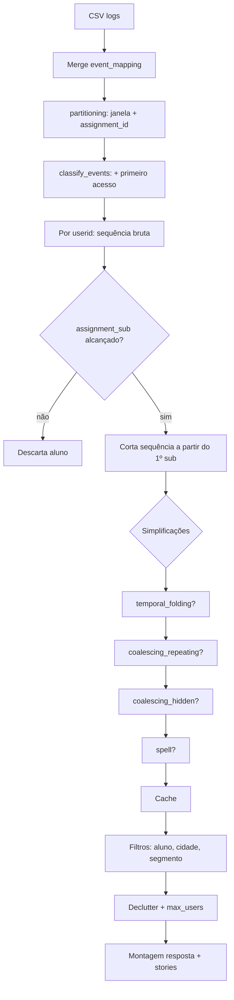

# Documentação Técnica — Trajetórias de Aprendizagem (SEE 2060)

Ferramenta de visualização analítica com foco em **timeline de coordenadas paralelas**, storytelling educacional e filtros para docentes. Este documento descreve a stack, a arquitetura, o pipeline de processamento de dados, a API e exemplos de payloads.

---

## 1. Visão geral

O sistema é um **monólito em dois serviços** (backend + frontend) orquestrado via Docker Compose:

```
┌─────────────────┐     HTTP (browser)      ┌──────────────────────────────┐
│  Next.js :3000  │ ──────────────────────► │  FastAPI :8000               │
│  Mantine + D3   │   /api/* (direto ou     │  pandas + cache em memória   │
│                 │    proxy interno)       │  CSVs em /data               │
└─────────────────┘                         └──────────────────────────────┘
```

**Fluxo principal:** logs brutos do Moodle → mapeamento de eventos → sequência por aluno → simplificações opcionais → filtros → resposta JSON para o gráfico D3 + narrativas (stories).

---

## 2. Stack tecnológica

### 2.1 Backend

| Componente | Tecnologia | Papel |
|------------|------------|-------|
| Runtime | Python 3.12 | Processamento de dados |
| API | FastAPI 0.115 | Endpoints REST + OpenAPI/Swagger |
| Servidor | Uvicorn | ASGI |
| Dados | pandas 2.2 | Leitura, merge, groupby, filtros |
| Validação | Pydantic 2.x | Schemas de entrada/saída |
| Compressão | GZip middleware | Respostas grandes da timeline |
| Persistência | CSV em memória | Sem banco; carga no startup |

### 2.2 Frontend

| Componente | Tecnologia | Papel |
|------------|------------|-------|
| Framework | Next.js 15 (App Router) | SPA + build standalone |
| UI | Mantine UI 7 | Layout, filtros, KPIs, painéis |
| Gráficos | D3.js 7 | Timeline paralela + barras |
| Ícones | Tabler Icons | Tipos de evento e navegação |
| Atualização | `useDebouncedValue` (450 ms) | Recarrega ao mudar filtros |

### 2.3 Infraestrutura

| Item | Detalhe |
|------|---------|
| Orquestração | `docker-compose.yml` |
| Dados | Volume `./data:/data:ro` no backend |
| Variáveis | `TL_DATA_DIR`, `NEXT_PUBLIC_API_URL` |
| Docs API | Swagger: `http://localhost:8000/docs` |

---

## 3. Estrutura do repositório

```
ws-mestrado/
├── data/                              # CSVs de entrada (não versionar se muito grandes)
│   ├── see_course2060_*_logs_filtered.csv
│   ├── event_mapping.csv
│   ├── see_course2060_quiz_list.csv
│   ├── see_course2060_quiz_grades.csv
│   ├── see_course2060_timeline.csv
│   └── user_list_see.csv
├── backend/
│   └── app/
│       ├── main.py                    # FastAPI, rotas, lifespan
│       ├── config.py                  # Limiares, ordem de classes, caminhos
│       ├── schemas.py                 # Modelos Pydantic (API + Swagger)
│       ├── data_loader.py             # DataStore: carga e métricas por aluno
│       ├── event_pipeline.py          # Simplificações (port do script original)
│       ├── fast_pipeline.py           # Pipeline otimizado (groupby + merge único)
│       ├── cache.py                   # Cache de sequências pré-processadas
│       ├── services.py                # build_timeline, get_meta, warmup
│       └── stories.py                 # Motor de narrativas R4–R44
├── frontend/
│   └── src/
│       ├── app/page.tsx               # Dashboard principal
│       ├── components/                # Timeline D3, filtros, KPIs, stories
│       └── lib/events.tsx             # Rótulos PT + ícones por classe
└── docs/
    └── DOCUMENTACAO_TECNICA.md        # Este arquivo
```

---

## 4. Fontes de dados (CSVs)

### 4.1 Logs (`see_course2060_12-11_to_11-12_logs_filtered.csv`)

Registros de atividade do Moodle. Colunas principais:

| Coluna | Tipo | Descrição |
|--------|------|-----------|
| `id` | int | Identificador do log (index) |
| `userid` | int | Aluno |
| `t` | int | Timestamp Unix |
| `component` | str | Módulo Moodle (`mod_quiz`, `core`, …) |
| `action` | str | Ação (`viewed`, `submitted`, …) |
| `target` | str | Alvo (`course_module`, `attempt`, …) |
| `assignment_id` | int? | Quiz vinculado (quando aplicável) |

### 4.2 Mapeamento (`event_mapping.csv`)

Tripla `(component, action, target)` → **classe semântica** usada no eixo Y da timeline:

| component | action | target | class |
|-----------|--------|--------|-------|
| core | viewed | course | `course_vis` |
| mod_resource | viewed | course_module | `resource_vis` |
| mod_quiz | viewed | course_module | `assignment_vis` |
| mod_quiz | started | attempt | `assignment_try` |
| mod_quiz | submitted | attempt | `assignment_sub` |
| mod_forum | viewed | course_module | `forum_vis` |
| … | … | … | … |

### 4.3 Outros arquivos

| Arquivo | Uso |
|---------|-----|
| `see_course2060_quiz_list.csv` | Janelas `t_open` / `t_close` por atividade |
| `see_course2060_quiz_grades.csv` | Notas por aluno e atividade |
| `see_course2060_timeline.csv` | Competências e datas de fechamento |
| `user_list_see.csv` | Nome, cidade, cadastro |
| `see_course2060_resource_list.csv` | Enriquecimento futuro de tooltips |

### 4.4 Mapeamento atividade ↔ competência

| Atividade | ID | Competência |
|-----------|-----|-------------|
| Atividade 1 | 12841 | Competência 1 |
| Atividade 2 | 12842 | Competência 2 |
| Atividade 3 | 12843 | Competência 3 |
| Atividade 4 | 12844 | Competência 4 |

---

## 5. Backend — funcionamento detalhado

### 5.1 Ciclo de vida (startup)

```
1. lifespan() em main.py
2. store.load()          → lê todos os CSVs
3. logs_mapped         → merge único logs + event_mapping
4. warmup_cache()      → pré-computa sequências das 4 atividades
5. API pronta          → healthcheck passa após warmup (~5–30 s)
```

O **cache em memória** (`cache.py`) armazena sequências por chave hashada:

```
assignment_id + janela temporal + flags de simplificação
```

Requisições repetidas com os mesmos parâmetros de simplificação respondem em **< 1 s**. Filtros leves (aluno, cidade, segmento) são aplicados **após** o cache.

### 5.2 Pipeline de processamento (diagrama)



### 5.3 Etapas do pipeline

#### (1) Particionamento (`partitioning`)

- Filtra logs por `t >= t_open` e `t <= t_close`.
- Se `assignment_id` informado: mantém logs da atividade **ou** logs gerais (`component != core/mod_page`).
- Recupera notas do quiz correspondente.

#### (2) Classificação (`classify_events`)

- Concatena o **primeiro acesso** de cada aluno ao conjunto de atividade (comportamento do script original de mineração de sequência).

#### (3) Geração de sequência por aluno (`fast_pipeline`)

Para cada `userid`:

1. Ordena eventos por `t`.
2. Aplica mapeamento → `event_class`.
3. Remove o primeiro evento (`pop(0)` do script original).
4. **Corte semântico:** percorre de trás para frente até encontrar o primeiro `assignment_sub`; só eventos a partir desse ponto entram na sequência analítica.
5. Aplica simplificações (seção 6).

#### (4) Pós-processamento na resposta (`build_timeline`)

- Achata sessões em lista linear com `seq_index` (eixo X).
- Filtra classes raras (`message_*`) se `hide_rare_classes`.
- `declutter_mode = first_class`: mantém só a 1ª ocorrência de cada classe.
- Limita a `max_users` trilhas.
- Calcula `adherence` (caminho ideal), `highlight`, KPIs e stories.

### 5.4 Caminho ideal (`FLOW_SEQUENCE`)

Sequência esperada de preparação:

```
course_vis → resource_vis → assignment_vis → assignment_try → assignment_sub
```

**Score de aderência:**

```
aderência = etapas_concluídas_no_fluxo / 5
```

### 5.5 Métricas por aluno (`compute_user_metrics`)

Derivadas de `quiz_grades` nas atividades 12841–12844:

| Métrica | Regra |
|---------|-------|
| `mean_ratio` | Média de `student_grade / max_grade` |
| `delta` | Última nota − primeira nota (normalizada) |
| `segment` | `risk` (< 0,50), `high` (≥ 0,75), `medium` |
| `trend` | `dropping` (Δ ≤ −0,20), `improving` (Δ ≥ +0,15), `stable` |

### 5.6 Decluttering automático

Sugestão ativada quando:

- `total_events_visible > 500`, **ou**
- média > 80 eventos por aluno na visão atual.

---

## 6. Tipos de simplificação

Equivalentes às flags CLI do script de pré-processamento original.

| Flag API | CLI original | Comportamento |
|----------|--------------|---------------|
| `multilevel` | `--multilevel` | Sufixo `_START` ou `_END` conforme evento ocorre na 1ª ou 2ª metade do prazo |
| `coalescing_repeating` | `--coalescing-repeating` | Remove repetições adjacentes do mesmo evento; em `assignment_sub` remove o anterior |
| `coalescing_hidden` | `--coalescing-hidden` | Remove passos intermediários: `assignment_vis` antes de `try/sub`, `assignment_try` antes de `sub` |
| `spell` | `--spell` | Conta sequências repetidas; marca `_SOME` (3–5) ou `_MANY` (>5); **desativa** `coalescing_repeating` |
| `temporal_folding` | `--temporal-folding` | Quebra em sessões quando gap entre eventos > **3600 s** (1 h) |

**Ordem de aplicação** (por sessão):

```
temporal_folding → coalescing_repeating → coalescing_hidden → spell
```

### Exemplo conceitual

Sequência bruta:

```
resource_vis → assignment_vis → assignment_try → assignment_sub → assignment_sub
```

Com `coalescing_hidden: true`:

```
resource_vis → assignment_sub
```

Com `coalescing_repeating: true` (sem hidden):

```
resource_vis → assignment_vis → assignment_try → assignment_sub
```

---

## 7. Motor de narrativas (stories)

Implementado em `stories.py`. Cada regra tem:

- `id` (R4, R5, …)
- `category`: `deadline`, `prep`, `bottleneck`, `profile`
- `highlight`: `risk`, `good`, `attention`
- `min_impact_pct`: limiar mínimo de alunos afetados para aparecer na resposta

### 7.1 Catálogo implementado

| ID | Categoria | Título | Destaque |
|----|-----------|--------|----------|
| R4 | deadline | Inatividade antes do fechamento | risk |
| R5 | deadline | Submissão sem preparação prévia | risk |
| R6 | deadline | Primeira tentativa na última hora | attention |
| R7 | bottleneck | Visualizou mas nunca tentou | attention |
| R19 | deadline | Entrada tardia no curso | attention |
| R21 | bottleneck | Demora entre visualizar e tentar | attention |
| R27 | deadline | Longos períodos sem acesso | risk |
| R30 | bottleneck | Tentou mas não submeteu | attention |
| R32 | prep | Fluxo ideal incompleto | attention |
| R33 | deadline | Correria nas últimas 48h | attention |
| R34 | deadline | Pico de acessos nos últimos dias | attention |
| R35 | deadline | Alunos só na segunda metade do prazo | attention |
| R37 | prep | Revisita aos materiais após submissão | good |
| R41 | profile | Perfil de correria recorrente | risk |
| R43 | profile | Perfil preparado e antecipado | good |
| R44 | profile | Perfil de risco silencioso | risk |

### 7.2 Limiares configuráveis (`thresholds` no request)

| Parâmetro | Padrão | Uso |
|-----------|--------|-----|
| `low_grade` | 0,50 | Segmento em risco |
| `high_grade` | 0,75 | Alto desempenho |
| `delta_drop` | 0,20 | Tendência de queda |
| `delta_rise` | 0,15 | Tendência de melhora |
| `late_try_hours` | 24 | R6 — primeira tentativa tardia |
| `inactivity_days` | 5 | R4 — inatividade pré-deadline |
| `resource_prep_days` | 7 | R5 — janela de preparação |

---

## 8. API REST

### Endpoints

| Método | Rota | Descrição |
|--------|------|-----------|
| GET | `/api/health` | Status e entradas no cache |
| GET | `/api/meta` | Metadados, alunos, filtros disponíveis |
| POST | `/api/timeline` | Timeline + KPIs + stories |
| GET | `/api/stories?assignment_id=` | Preview de narrativas |
| GET | `/docs` | Swagger UI |
| GET | `/openapi.json` | Esquema OpenAPI |

---

## 9. Exemplos de payload

### 9.1 Entrada — `POST /api/timeline` (turma, padrão dashboard)

```json
{
  "assignment_id": 12841,
  "user_ids": null,
  "cities": null,
  "event_classes": null,
  "segment": null,
  "simplification": {
    "multilevel": false,
    "coalescing_repeating": false,
    "coalescing_hidden": true,
    "spell": false,
    "temporal_folding": false
  },
  "thresholds": {
    "low_grade": 0.5,
    "high_grade": 0.75,
    "delta_drop": 0.2,
    "delta_rise": 0.15,
    "late_try_hours": 24,
    "inactivity_days": 5,
    "resource_prep_days": 7
  },
  "declutter_mode": "first_class",
  "max_users": 300,
  "hide_rare_classes": true,
  "compare_mode": "team"
}
```

### 9.2 Entrada — trilha individual (um aluno)

```json
{
  "assignment_id": 12841,
  "user_ids": [88802],
  "simplification": {
    "multilevel": false,
    "coalescing_repeating": false,
    "coalescing_hidden": true,
    "spell": false,
    "temporal_folding": false
  },
  "declutter_mode": "first_class",
  "max_users": 1,
  "hide_rare_classes": true,
  "compare_mode": "team"
}
```

### 9.3 Entrada — filtros combinados

```json
{
  "assignment_id": 12842,
  "cities": ["Recife"],
  "segment": "risk",
  "event_classes": ["assignment_vis", "assignment_try", "assignment_sub"],
  "simplification": {
    "multilevel": true,
    "coalescing_repeating": false,
    "coalescing_hidden": true,
    "spell": false,
    "temporal_folding": true
  },
  "declutter_mode": "none",
  "max_users": 150
}
```

### 9.4 Saída — trecho de `POST /api/timeline` (turma)

```json
{
  "kpis": {
    "users_filtered": 300,
    "users_total_sequences": 2085,
    "at_risk": 42,
    "mean_grade_ratio": 0.612,
    "total_events_visible": 983,
    "improving": 18,
    "dropping": 95
  },
  "quiz": {
    "id": 12841,
    "name": "Atividade 1",
    "t_open": 1573527600,
    "t_close": 1574218500
  },
  "event_classes": [
    "course_vis",
    "resource_vis",
    "assignment_vis",
    "assignment_try",
    "assignment_sub"
  ],
  "declutter_suggested": false,
  "course_start": 1573527600,
  "course_end": 1576032900,
  "flow_sequence": [
    "course_vis",
    "resource_vis",
    "assignment_vis",
    "assignment_try",
    "assignment_sub"
  ],
  "active_rules": ["R4", "R5", "R6", "R7", "R19", "R21", "R32", "R33", "R34", "R35", "R37", "R41", "R43", "R44"],
  "users": [
    {
      "userid": 91614,
      "events": [
        { "event": "resource_vis", "time": 1573584531, "class": "resource_vis", "seq_index": 0 },
        { "event": "assignment_vis", "time": 1574104086, "class": "assignment_vis", "seq_index": 1 },
        { "event": "assignment_sub", "time": 1574188846, "class": "assignment_sub", "seq_index": 2 }
      ],
      "sessions": 1,
      "temporal_folding": false,
      "grade_ratio": 0.75,
      "delta": -0.25,
      "segment": "high",
      "trend": "dropping",
      "adherence": 0.6,
      "highlight": "risk"
    }
  ],
  "stories": [
    {
      "id": "R4",
      "category": "deadline",
      "title": "Inatividade antes do fechamento",
      "question": "Quem ficou inativo nos 5 dias anteriores ao fechamento teve desempenho significativamente menor?",
      "highlight": "risk",
      "affected_count": 180,
      "affected_pct": 8.6,
      "affected_users": [87553, 121349, 64005]
    },
    {
      "id": "R5",
      "category": "deadline",
      "title": "Submissão sem preparação prévia",
      "question": "Quem submeteu sem resource_vis nos 7 dias antes da entrega?",
      "highlight": "risk",
      "affected_count": 293,
      "affected_pct": 14.1,
      "affected_users": [137216, 111618]
    }
  ]
}
```

### 9.5 Saída — aluno individual (`userid: 88802`)

```json
{
  "userid": 88802,
  "events": [
    { "event": "assignment_vis", "time": 1573596979, "class": "assignment_vis", "seq_index": 0 },
    { "event": "assignment_try", "time": 1573741475, "class": "assignment_try", "seq_index": 1 },
    { "event": "assignment_sub", "time": 1574191910, "class": "assignment_sub", "seq_index": 2 }
  ],
  "kpis": {
    "users_filtered": 1,
    "users_total_sequences": 1,
    "at_risk": 1,
    "mean_grade_ratio": 0.417,
    "total_events_visible": 3
  }
}
```

### 9.6 Saída — `GET /api/meta` (trecho)

```json
{
  "course": {
    "id": 2060,
    "name": "Cargos e Salários (RHM) 2019.2",
    "start": 1573527600,
    "end": 1576032900
  },
  "quizzes": [
    {
      "id": 12841,
      "name": "Atividade 1",
      "t_open": 1573527600,
      "t_close": 1574218500,
      "max_grade": 2.0,
      "grade_pass": 1.0,
      "section": "Competência 1"
    }
  ],
  "students": [
    { "userid": 88802, "name": "Nome do Aluno", "city": "Recife" }
  ],
  "event_classes": {
    "course_vis": 79637,
    "assignment_vis": 46014,
    "forum_vis": 33549,
    "resource_vis": 13480
  },
  "users_registered": 2935,
  "users_with_logs": 2521,
  "segments": { "risk": 506, "high": 894, "medium": 1121 },
  "trends": { "improving": 629, "dropping": 988, "stable": 904 }
}
```

### 9.7 Saída — `GET /api/health`

```json
{
  "status": "ok",
  "users_in_logs": 2521,
  "cache_entries": 4
}
```

---

## 10. Semântica dos campos da resposta

### Evento na timeline

| Campo | Descrição |
|-------|-----------|
| `event` | Classe após simplificação (pode ter `_START`, `_SOME`, etc.) |
| `class` | Classe base (eixo Y no D3) |
| `time` | Timestamp Unix do log original |
| `seq_index` | Posição no eixo X (ordem na sequência) |

### Aluno (`users[]`)

| Campo | Descrição |
|-------|-----------|
| `highlight` | `risk`, `good`, `neutral` — cor da trilha no frontend |
| `adherence` | 0–1 — proporção do caminho ideal concluído |
| `sessions` | Número de sessões após `temporal_folding` |

---

## 11. Frontend — consumo da API

1. `GET /api/meta` no mount → popula filtros (alunos, cidades, atividades).
2. Qualquer mudança de filtro → debounce 450 ms → `POST /api/timeline`.
3. Browser chama `http://localhost:8000` diretamente (`NEXT_PUBLIC_API_URL`) para evitar timeout do proxy Next.
4. D3 renderiza:
   - **Eixo X:** `seq_index`
   - **Eixo Y:** `event_classes` com ícones/rótulos em português
   - **Cor da trilha:** `highlight` do aluno

---

## 12. Variáveis de ambiente

| Variável | Serviço | Padrão | Descrição |
|----------|---------|--------|-----------|
| `TL_DATA_DIR` | backend | `/data` | Pasta dos CSVs |
| `TL_SESSION_GAP` | backend | `3600` | Gap de sessão (s) |
| `TL_LOW_GRADE` | backend | `0.50` | Limiar de risco |
| `NEXT_PUBLIC_API_URL` | frontend | `http://localhost:8000` | URL da API no browser |
| `API_INTERNAL_URL` | frontend | `http://backend:8000` | URL interna Docker/SSR |

---

## 13. Execução

```bash
# Docker (recomendado)
docker compose up --build

# URLs
# Frontend:  http://localhost:3000
# API:       http://localhost:8000
# Swagger:   http://localhost:8000/docs
```

---

## 14. Limitações e extensões futuras

| Limitação atual | Extensão sugerida |
|-----------------|-------------------|
| Dados só em CSV em RAM | SQLite/Parquet para datasets maiores |
| Eixo X = índice, não tempo absoluto | Modo temporal com zoom por data |
| Subconjunto de regras R4–R44 | Completar catálogo (fórum, fim de semana, chat) |
| `compare_mode` reservado | Modo comparativo turma vs segmento na UI |
| Tooltips sem título de recurso | Join com `resource_list.csv` |

---

## 15. Referências no código

| Conceito | Arquivo |
|----------|---------|
| Simplificações | `backend/app/event_pipeline.py` |
| Pipeline rápido | `backend/app/fast_pipeline.py` |
| Orquestração API | `backend/app/services.py` |
| Stories | `backend/app/stories.py` |
| Schemas / Swagger | `backend/app/schemas.py`, `backend/app/main.py` |
| Ícones e rótulos PT | `frontend/src/lib/events.tsx` |

---

*Documento gerado para o projeto ws-mestrado — curso SEE 2060 (UPE).*
