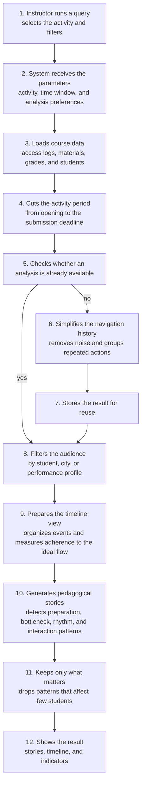

# Story generation flow

How the tool turns course data into narratives for the instructor.

## One sentence per step

1. **Query** — the instructor chooses the activity and how to look at the class  
2. **Parameters** — the system understands the scope of the analysis  
3. **Data** — loads the available course history  
4. **Period** — limits the analysis to the activity window  
5. **Reuse** — avoids recomputing what was already processed  
6. **Simplification** — cleans and summarizes student navigation  
7. **Memory** — stores that summary for later queries  
8. **Filter** — focuses on the students or profiles of interest  
9. **Timeline** — organizes the visual path and adherence to the expected flow  
10. **Stories** — turns behavior patterns into narratives for the instructor  
11. **Relevance** — shows only what has enough impact on the class  
12. **Result** — returns stories, timeline, and summary indicators  
